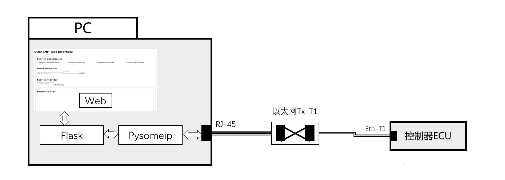
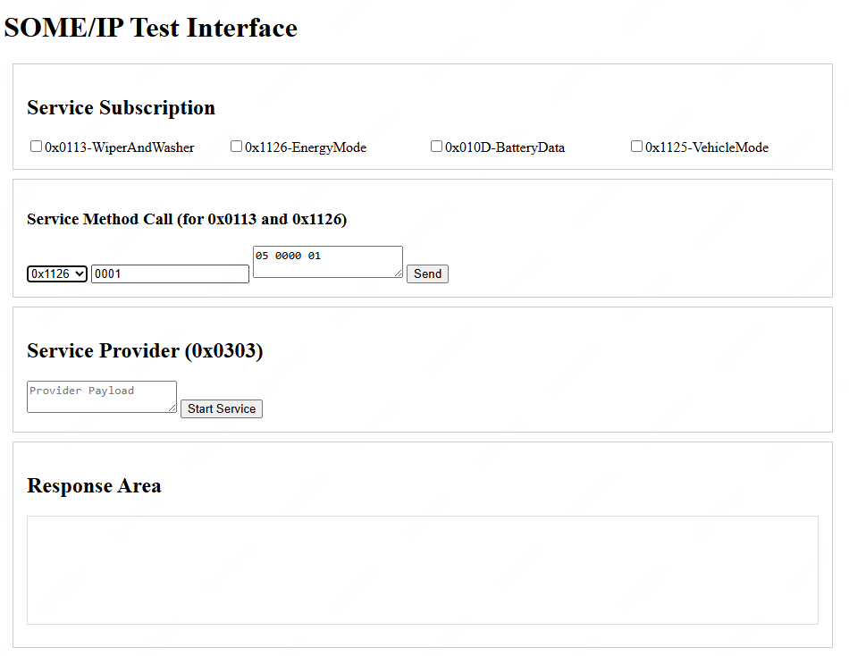

# SomeIP_Web_App
This project provides a web-based HTML interface for SOME/IP message sending and receiving.

## 项目介绍
这是一个基于 Web 的测试工具，用于发送和接收 SOME/IP 消息。通过简单的 HTML 界面，用户可以订阅 SOME/IP 服务、发送方法调用请求，并实时查看响应数据。该项目旨在简化 SOME/IP 通信的测试和调试过程。

## TaskList
- [x] SOME/IP基础功能
    - [x] 服务订阅
    - [x] 服务调用
    - [ ] 服务提供
- [ ] 页面布局
    - [x] Log区域
    - [ ] 目标地址配置区域
    - [ ] 控制页面优化
- [ ] 高级
    - [ ] Arxml导入控件生成
    - [ ] Arxml导出
    - [ ] TBD

## 项目结构
项目由以下三个主要文件组成：

1. **index.html**:
   - 主页面，包含用户界面和交互逻辑。
   - 提供服务订阅区、方法调用区和响应显示区。

2. **app.py**:
   - Flask 应用程序，作为后端代理。
   - 接收来自 `index.html` 的 HTTP 请求，并将数据转发给 `someip_midware.py`。

3. **someip_midware.py**:
   - 实现 SOME/IP 协议栈功能。
   - 配置 IP 地址、多播地址和端口号等信息。
   - 使用 `someip` 库发送和接收 SOME/IP 消息。

## 功能介绍

### 1. 页面截图


### 2. 服务订阅区
- **功能**：允许用户通过复选框订阅特定的 SOME/IP 服务。
- **支持的服务 ID**：
  - 0x1111 (WiperWasher)
  - 0x2222 (EgySaveModeSts)
  - 0x3333 (LowBattData)
  - 0x4444 (VehModSts)

### 3. 方法调用区
- **功能**：允许用户发送方法调用请求。
- **支持的服务 ID 和方法 ID**：
  - 0x1111: Method ID `0001`，Payload `05 0000 01`
  - 0x2222: Method ID `0001`，Payload `05 0000 01`

### 4. 响应显示区
- **功能**：实时显示从 SOME/IP 服务接收到的响应数据。
- **显示格式**：
  - 原始 16 进制数据
  - 解析后的数据（根据协议结构）

### 5. 服务提供区
- **功能**：允许用户启动和管理本地 SOME/IP 服务。
- **支持的服务 ID**：
  - 0x0303 (示例服务)

## 使用方法

### 1. 启动后端服务
确保控制器端服务（或其他 SOME/IP 服务端）已启动并运行。服务端应监听指定的端口，以便与 Web 应用进行通信。

### 2. 运行 Flask 应用
运行 `app.py` 文件，启动 Flask 服务器：
```bash
python app.py
```
确保相关库已安装
```bash
pip install Flask
pip install someip
pip install flask_socketio
```
## 打包成exe程序
运行 
```bash
pyinstaller .\pysomip.spec
```
